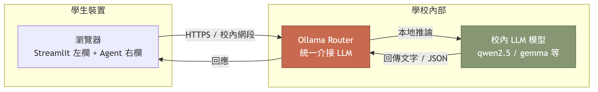
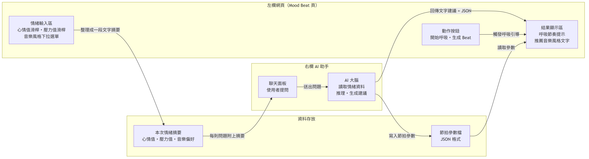
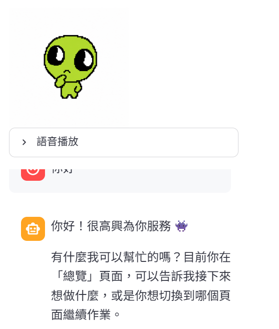

# Mood Beat — 專題報告

> 馬公高中 Agent Studio 專題 — Mood Beat
> 製作者：（請填寫）
> 完成日期：2026-06-24

---

## 1. 專題介紹

| 項目 | 內容 |
|------|------|
| 專題名稱 | Mood Beat |
| 一句話說明 | 讓使用者描述今天狀態，透過呼吸穩定節奏，最後產生專屬 beat |
| 主要使用者 | 喜歡音樂且喜歡心靈呼吸放鬆的人 |
| 解決痛點 | 壓力大、心情不愉快 |

---

## 2. 學校 Server 環境

> 全班使用相同的學校內部 LLM 路由，所有 API 連線皆透過此路由介接。
> 本報告不揭露 IP／URL 細節。

---

## 3. 左欄與右欄互動說明

### 左欄自訂頁

| 頁面 | 用途 |
|------|------|
| 4_Layout_Practice.py | 版面練習（demo 參考頁） |
| 5_Mood_Beat.py | **核心頁**：輸入情緒、啟動呼吸、生成 beat |

### 左欄 Mood Beat 頁面輸入元件

- 心情值滑桿（1–10）
- 壓力值滑桿（1–10）
- 音樂風格下拉選單
- 「開始呼吸」按鈕
- 「生成 Beat」按鈕

### 資料傳遞

左欄把「心情值、壓力值、音樂偏好」三項資料整理成一段文字摘要，傳給右欄 Agent。Agent 推理後回傳：

- **文字建議**（呼吸節奏提示、推薦音樂風格）
- **JSON 節拍參數**（含節拍 BPM、情緒標籤）

### 完整互動例子

> 我按了「生成 Beat」按鈕，Agent 收到心情值 7、壓力值 3、音樂偏好 lo-fi，然後左欄顯示呼吸節奏提示和「你的專屬 lo-fi beat 已生成」。

### 個人架構圖

---

## 4. 成果、創新與技術

### 4.1 成果（目前能 demo 的功能）

- 在左欄 Mood Beat 頁面用滑桿輸入心情值與壓力值
- 選擇喜歡的音樂風格（如 lo-fi、trap、輕音樂）
- 按下「開始呼吸」按鈕啟動呼吸引導
- 按下「生成 Beat」按鈕，將情緒資料傳給右欄 Agent
- 右欄 Agent 回傳文字建議與 JSON 節拍參數，左欄顯示推薦結果

### 4.2 創新／亮點

- 結合「情緒紀錄」「呼吸穩定」「音樂推薦」三個步驟，不只是純聊天或純音樂播放
- 用心情值、壓力值、音樂偏好三項資料，讓 Agent 產出個人化的 beat 風格建議
- 強調「先穩定心情、再創作音樂」的體驗流程，幫助使用者紓壓

### 4.3 技術含量

- Agent Studio + Streamlit 打造左欄自訂頁面
- Agent.chat 作為右欄對話與推理核心
- JSON 格式傳遞心情值、壓力值、音樂偏好
- LLM 根據情緒資料產生呼吸建議與音樂風格推薦
- 未來可串接 ACE Music 等音樂生成工具輸出實際 beat

---

## 5. 附錄：Demo 截圖

| demo | 頁面 | 檔名 |
|------|------|------|
| 02 | Mood Beat | `assets/demo-02.png` |

